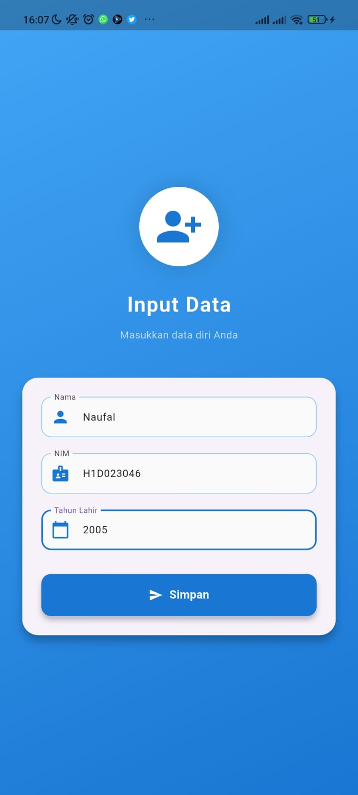

# Tugas 6 - Pemrograman Mobile

**Nama:** Naufal Aulia Pratama  
**NIM:** H1D023046  
**Tugas:** Passing Data dari Form ke Tampilan

---

## Penjelasan Proses Passing Data

Proses passing data dalam Flutter dilakukan dengan cara mengirimkan nilai dari satu halaman ke halaman lain melalui parameter konstruktor. Pertama-tama, dibuat beberapa controller untuk menampung data yang diinput pengguna, seperti berikut:

```dart
final _nama = TextEditingController();
final _nim = TextEditingController();
final _tahunLahir = TextEditingController();
```

Controller ini berfungsi sebagai wadah sementara yang menyimpan teks yang diketik di form. Setelah pengguna mengisi form dan menekan tombol Simpan, data yang dimasukkan dapat diambil menggunakan properti .text dari masing-masing controller:

```dart
_nama.text;          // Mengambil data nama
_nim.text;           // Mengambil data NIM
_tahunLahir.text;    // Mengambil data tahun lahir
```

Kemudian, data tersebut dikirim ke halaman lain menggunakan Navigator.push(). Pada bagian ini, MaterialPageRoute digunakan untuk menentukan halaman tujuan, dan data dikirim melalui parameter konstruktor dari kelas tujuan (TampilData):

```dart
Navigator.push(
  context,
  MaterialPageRoute(
    builder: (_) => TampilData(
      nama: _nama.text,
      nim: _nim.text,
      tahunLahir: _tahunLahir.text,
    ),
  ),
);
```

Di halaman penerima, yaitu tampil_data.dart, kelas TampilData harus memiliki variabel yang digunakan untuk menampung data yang dikirim. Variabel-variabel tersebut dideklarasikan sebagai parameter konstruktor dan ditandai dengan kata kunci required, yang berarti nilainya wajib dikirim:

```dart
class TampilData extends StatelessWidget {
  final String nama, nim, tahunLahir;

  const TampilData({
    Key? key,
    required this.nama,
    required this.nim,
    required this.tahunLahir,
  }) : super(key: key);

  @override
  Widget build(BuildContext context) {
    return Scaffold(
      appBar: AppBar(title: const Text('Data Mahasiswa')),
      body: Padding(
        padding: const EdgeInsets.all(16.0),
        child: Column(
          crossAxisAlignment: CrossAxisAlignment.start,
          children: [
            Text('Nama: $nama'),
            Text('NIM: $nim'),
            Text('Tahun Lahir: $tahunLahir'),
          ],
        ),
      ),
    );
  }
}
```

Setelah data diterima, nilainya dapat langsung ditampilkan menggunakan widget Text() sesuai kebutuhan.
---

## Screenshot

<h3>📸 Screenshoot Aplikasi</h3>

<p align="center">
  
  
</p>

---
